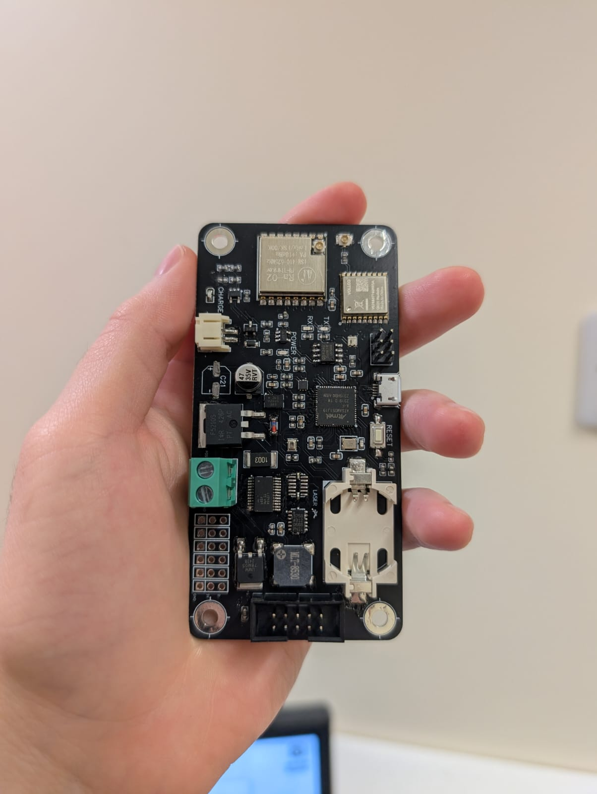
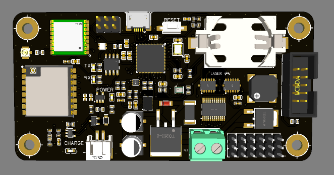

# LASER-Society-Flight-Computer

This is a **work in progress** rocket flight computer for the LASER society at the University of Liverpool.

The idea is to design and produce an open source flight controller board that the students of the LASER society can use in their model rocket designs. Since each rocket will be different, the idea is to create a board capable of operating in a wide range of designs, allowing the society to provide members with easy access to flight control hardware.

I have only done the hardware design so far, I plan to program the microcontroller myself to showcase its functionality or I can burn the Arduino bootloader to the board.

### Hardware

**Microcontroller**

The ATSAMD51 was chosen for the microcontroller. It has an Arm Cortex-M4 core that is clocked at 120MHz, an integrated floating point unit (FPU) and up to 1MB of flash, making it sufficient for any mission on a hobby rocket. It is also well documented, with many examples used in commerical microcontroller boards (like Adafruit's M4 Express). It can be interfaced with a SWD or JTAG connector for debugging.

This series of microcontroller also features a QSPI inteface, which makes it an excellent candidate for interfacing external flash memory.

**Flash**

The flight computer needs somewhere to store logged flight data outside of the MCU. Usually something like a micro SD card is used to store data. However, due to the high forces and shocks introduced by flying on a rocket, micro SD cards may break and become an unreliable storage method. So, instead of using an external micro SD card, I have opted to use an onboard flash memory interfaced through QSPI. The chosen flash memory is the GD25Q16ETIGR (16Mbit).

**Navigation and Control**

For navigation the board features a budget GNSS module made by VOLLGO. Since the rocket would only need to know its position within a few meters, it was decided that it was better to reduce the overall cost and go for a cheaper GNSS module. The GNSS module also has a coin cell battery to enable a "hot start", reducing the setup time for a launch.

Similarly, for communication a simple LoRa module is used, the RA-02. It provides long-distance spread spectrum communication and allows the flight computer to be somewhat flexible in terms of communication. Any live telemetry would focus on providing basic information about the flight and any high volume information would be loaded into the on board flash.

**Sensors**

Various sensors have been selected for the flight computer in order to provide as much useful information as possible. This includes the ADXL345 and ADXL375 high-resolution and high G accelerometers, the TMP117AIDRVR for temperature sensing, the BMP280 pressure sensor for atmospheric data/altitude and the BMI088 IMU for positioning data. These sensors are interfaced with the MCU using I2C and SPI connections. Further information about these sensors can be found in their respective datasheets.

**Power Design**

The board features two seperate battery connectors, the first is a 1S lipo connector that feeds into a battery management circuit + LDO combo that powers the MCU, sensors, GNSS and LoRa. Then there is a seperate terminal block designed to connect to a 2S lipo, which feeds into a 5V regulator. This allows the board to drive up to six high power servo motors for rockets that use active control and stabilisation.

The schematic and gerber files are available in the Hardware section of the repo, though I must warn that the current design may have issues in the power circuitry.
